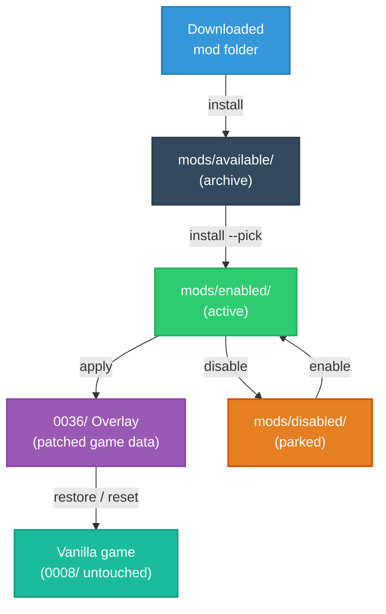

# Crimson Desert — JSON Mod Manager (macOS)

A command-line tool for applying **JSON modpatch** files to **Crimson Desert** on macOS. Patches are merged into a **safe overlay** (`0036/`); original archives in `0008/` are not modified. The game loads the overlay via `meta/0.papgt` (with `0.papgt.bak` created on first apply).

## How It Works

The manager reads active modpatch files from `mods/enabled/` and builds a separate modded overlay in `0036/` instead of editing the original game data in `0008/`.

### Apply Pipeline

```mermaid
graph LR
    A["mods/enabled/\n*.json / *.modpatch"] --> B["Read & Group\nby game_file"]
    B --> C["Locate data\nin 0008/0.pamt"]
    C --> D["Decompress\n(lz4.block)"]
    D --> E["Apply byte\npatches"]
    E --> F["Recompress\n(lz4.block)"]
    F --> G["Write to\n0036/0.paz\n0036/0.pamt"]
    G --> H["Update\nmeta/0.papgt"]
    H --> I["Game loads\noverlay 0036/"]

    classDef input fill:#3498db,stroke:#2980b9,stroke-width:2px,color:#fff
    classDef process fill:#2ecc71,stroke:#27ae60,stroke-width:2px,color:#fff
    classDef compress fill:#e67e22,stroke:#d35400,stroke-width:2px,color:#fff
    classDef output fill:#9b59b6,stroke:#8e44ad,stroke-width:2px,color:#fff
    classDef game fill:#1abc9c,stroke:#16a085,stroke-width:2px,color:#fff

    class A input
    class B,C process
    class D,E,F compress
    class G,H output
    class I game
```



### Mod Lifecycle



1. Read active `*.json` / `*.modpatch` files from `mods/enabled/`.
2. Group patch changes by `game_file`.
3. Use `0008/0.pamt` to find the original file data inside the base game archives.
4. Decompress the target data with `lz4.block`, apply the requested byte changes, then recompress it.
5. Write the patched output to `0036/0.paz` and `0036/0.pamt`.
6. Update `meta/0.papgt` so the game loads the new overlay group.

Technical notes:

- Original game data stays in `0008/`; the tool writes modded output to `0036/`.
- `pamt_patcher.py` is used to resolve file locations from `0.pamt`.
- `pa_checksum.py` is used to recalculate checksum fields for generated metadata.
- On first apply, the tool creates `meta/0.papgt.bak` so `restore` can return the game to vanilla state.

## Quick Start

This tool does three main things:

- install one mod variant
- disable an active mod and sync the game
- return the game to vanilla with `restore` or `reset`

It always writes modded data into the safe overlay folder `0036/`. The original game data in `0008/` is left untouched.

### Mod lifecycle directories

- `mods/available/` — installed archive copies (not active yet)
- `mods/enabled/` — active mods used by `apply`
- `mods/disabled/` — temporarily disabled mods (non-destructive)

## Requirements

- **macOS** (App Store / standalone `.app` layout)
- **Python 3.9+**
- **`lz4`** (`pip3 install -r requirements.txt`)
- **Crimson Desert** — the game bundle must be writable for `apply` (see [Troubleshooting](#troubleshooting))

## Installation

```bash
python3 -m pip install -r requirements.txt
chmod +x mod_manager.py
```

Clone or download this project, then run commands from that folder (or `python3 /path/to/mod_manager.py …`).

## Usage

### Set game path (first time)

Auto-detection tries `/Applications/Crimson Desert.app`, `~/Applications/…`, and common Steam paths.

```bash
./mod_manager.py set-game "/Applications/Crimson Desert.app"
```

The path is saved in `_game_path.json` (optional). Override with `--game <path>` on any command or set `CRIMSON_DESERT_GAME`.

After you run `set-game` once, you normally do **not** need to pass `--game` again; it only serves as an override when you want to point to a different install.

### Wizard

```bash
./mod_manager.py wizard
```

The wizard is the “beginner” flow. It keeps choices simple and always works with:
- `mods/enabled/` (active, used by `apply`)
- `mods/disabled/` (parked)
- `mods/available/` (archive)

Menu (what each option does):
1. `1` Install from folder (if the folder has multiple variants, you choose exactly one)
2. `2` List enabled mods, then prompt: “Disable which mod? … (0 to go back)”
3. `3` List disabled mods, then prompt: “Enable which mod? … (0 to go back)”
4. `4` List available mods, then prompt: “Activate which mod? … (0 to go back)”
5. `5` Disable a mod and sync the game
6. `6` Apply mods to the game (build overlay `0036/`)
7. `7` Restore game only (remove overlay; keep mod folders)
8. `8` Reset active mods to vanilla (restore + clear `mods/enabled/`)
9. `9` Status
10. `10` Start game
0. `0` Exit

Tip: After `set-game` once, you usually don’t need `--game` again.

### Install Mods

```bash
./mod_manager.py install ./mods/stamina_json_v1.02.00 --pick
./mod_manager.py install ./mods/stamina_json_v1.02.00 --pick --apply
./mod_manager.py install ~/Downloads/stamina_json_v1.02.00 --pick --apply
```

Copies one selected `*.json` / `*.modpatch` into both `mods/available/` (archive) and `mods/enabled/` (active). If a folder contains several mod files, you must choose exactly one variant.

**Tip:** `install --apply` copies and patches in one step.

Only one modpack that patches the same `game_file` should be active at a time.

### Main Commands

```bash
./mod_manager.py list
./mod_manager.py apply
./mod_manager.py restore                   # vanilla overlay only; active mod files stay queued
./mod_manager.py disable 1                 # disable + sync game now
./mod_manager.py disable stamina_v1.02.00_infinite
./mod_manager.py reset                     # restore + clear only mods/enabled/ (prompt)
./mod_manager.py status
./mod_manager.py start-game
```

### Restore vs Reset

- **`restore`** makes the game vanilla again by removing the active overlay, but keeps your active mod files in `mods/enabled/`.
- **`reset`** does `restore` and also clears `mods/enabled/`.

After `apply`, `restore`, `disable`, or `reset`, restart the game when the game data changed.

**`reset`:** Restores the game to vanilla and clears only `mods/enabled/`. It keeps `mods/disabled/` and `mods/available/`. Use this when you want a clean vanilla game state without losing your archived or parked mods. In an interactive terminal you get a confirmation prompt. If stdin is not a TTY (pipes, some IDE tasks), you must pass **`-y`** or the command aborts.

Use `./mod_manager.py COMMAND -h` for subcommand help.

Example stamina packs for **game data v1.02.00** live under `mods/stamina_json_v1.02.00/` — pick **one** variant and `install` it.

## Example: stamina (v1.02.00)

```bash
./mod_manager.py set-game "/Applications/Crimson Desert.app"
./mod_manager.py scan ./mods/stamina_json_v1.02.00
./mod_manager.py install ./mods/stamina_json_v1.02.00 --pick --apply
./mod_manager.py status
./mod_manager.py restore
```

## Troubleshooting

### Permission denied (do not use `sudo python3`)

Prefer owning the app bundle:

```bash
sudo chown -R "$(whoami)" "/Applications/Crimson Desert.app"
```

Or install the game under `~/Applications` and `set-game` there.

### Many `SKIP` lines when applying

The mod JSON targets a different game build. You need an updated modpatch or refreshed offsets/`original` hex.

### Game issues after modding

```bash
./mod_manager.py restore --game "/Applications/Crimson Desert.app"
```

The tool never modifies `0008/`; if `.bak` is missing, repair/reinstall the game as needed.

### Gatekeeper / “damaged” app (at your own risk)

```bash
xattr -cr "/Applications/Crimson Desert.app"
```

## License

[MIT](LICENSE)

## Credits

- **Pearl Abyss** — *Crimson Desert*
- Community JSON modpatch / overlay tooling
